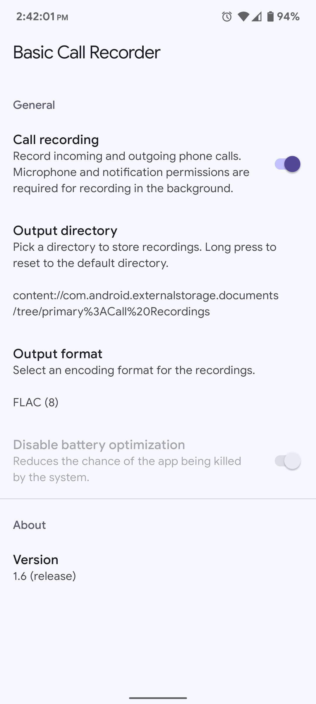
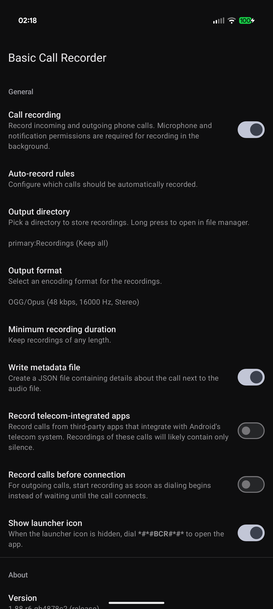

# Basic Call Recorder


BCR is a simple Android call recording app for rooted devices or devices running custom firmware. Once enabled, it stays out of the way and automatically records incoming and outgoing calls in the background.

 

## Features

* Supports Android 9 through 13
* Supports output in various formats:
  * OGG/Opus - Lossy, smallest files, default on Android 10+
  * M4A/AAC - Lossy, smaller files, default on Android 9
  * FLAC - Lossless, larger files
  * WAV/PCM - Lossless, largest files, least CPU usage
* Supports Android's Storage Access Framework (can record to SD cards, USB devices, etc.)
* Per-contact auto-record rules
* Quick settings toggle
* Material You dynamic theming
* No persistent notification unless a recording is in progress
* No network access permission
* Works with call screening on Pixel devices (records the caller, but not the automated system)

## Non-features

As the name alludes, BCR intends to be a basic as possible. The project will have succeeded at its goal if the only updates it ever needs are for compatibility with new Android versions. Thus, many potentially useful features will never be implemented, such as:

* Support for old Android versions (support is dropped as soon as maintenance becomes cumbersome)
* Workarounds for [OEM-specific battery optimization and app killing behavior](https://dontkillmyapp.com/)
* Workarounds for devices that don't support the [`VOICE_CALL` audio source](https://developer.android.com/reference/android/media/MediaRecorder.AudioSource#VOICE_CALL) (eg. using microphone + speakerphone)
* Support for direct boot mode (the state before the device is initially unlocked after reboot)
* Support for stock, unrooted firmware

## Usage

1. Download the latest version from the [releases page](https://github.com/chenxiaolong/BCR/releases). To verify the digital signature, see the [verifying digital signatures](#verifying-digital-signatures) section.

2. Install BCR as a system app.

    * **For devices rooted with Magisk**, simply flash the zip as a Magisk module from within the Magisk app.
        * **For OnePlus and Realme devices running the stock firmware (or custom firmware based on the stock firmware)**, also extract the `.apk` from the zip and install it manually before rebooting. This is necessary to work around a bug in the firmware where the app data directory does not get created, causing BCR to open up to a blank screen.

    * **For unrooted custom firmware**, flash the zip while booted into recovery.
        * **NOTE**: The `READ_CALL_LOG` permission is hard restricted in Android 10+, which prevents it from being granted, even via Android's settings. To remove this restriction, run via adb:
          ```bash
          # If rooted, run inside of `su`:
          CLASSPATH=/system/priv-app/com.chiller3.bcr/app-release.apk app_process / com.chiller3.bcr.standalone.RemoveHardRestrictionsKt

          # If unrooted, install BCR as both a user app and a system app:
          pm install /system/priv-app/com.chiller3.bcr/app-release.apk
          ```
        * **NOTE**: If the custom firmware's `system` partition is formatted with `erofs`, then the filesystem is read-only and it is not possible to use this method.
        * Manually extracting the files from the `system/` folder in the zip will also work as long as the files have `644` permissions and the `u:object_r:system_file:s0` SELinux label.

3. Reboot and open BCR.

4. Enable call recording and pick an output directory. If no output directory is selected or if the output directory is no longer accessible, then recordings will be saved to `/sdcard/Android/data/com.chiller3.bcr/files`.

    When enabling call recording the first time, BCR will prompt for microphone, notification (Android 13+), call log, contacts, and phone permissions. Only microphone and notification permissions are required basic call recording functionality. If additional permissions are granted, more information is added to the output filename. For example, the contacts permission will allow the contact name to be added to the filename.

    See the [permissions section](#permissions) below for more details about the permissions.

5. To install future updates, there are a couple methods:

    * If installed via Magisk, the module can be updated right from Magisk Manager's modules tab. Flashing the new version in Magisk manually also works just as well.
    * The `.apk` can also be extracted from the zip and be directly installed. With this method, the old version exists as a system app and the new version exists as a user-installed update to the system app. This method is more convenient if BCR is baked into the Android firmware image.

## Permissions

* `CAPTURE_AUDIO_OUTPUT` (**automatically granted by system app permissions**)
  * Needed to capture the call audio stream.
* `CONTROL_INCALL_EXPERIENCE` (**automatically granted by system app permissions**)
  * Needed to monitor the phone call state for starting and stopping the recording and gathering call information for the output filename.
* `RECORD_AUDIO` (**must be granted by the user**)
  * Needed to capture the call audio stream.
* `FOREGROUND_SERVICE` (**automatically granted at install time**)
  * Needed to run the call recording service.
* `POST_NOTIFICATIONS` (**must be granted by the user on Android 13+**)
  * Needed to show notifications.
  * A notification is required for running the call recording service in foreground mode or else Android will not allow access to the call audio stream.
* `READ_CALL_LOG` (**optional**)
  * If allowed, the name as shown in the call log can be added to the output filename.
* `READ_CONTACTS` (**optional**)
  * If allowed, the contact name can be added to the output filename. It also allows auto-record rules to be set per contact.
* `READ_PHONE_STATE` (**optional**)
  * If allowed, the SIM slot for devices with multiple active SIMs is added to the output filename.
* `REQUEST_IGNORE_BATTERY_OPTIMIZATIONS` (**optional**)
  * If allowed, request Android to disable battery optimizations (app killing) for BCR.
  * This is usually not needed. The way BCR hooks into the telephony system makes it unlikely to be killed.
  * OEM Android builds that stray further from AOSP may ignore this.
* `VIBRATE` (**automatically granted at install time**)
  * If vibration is enabled for BCR's notifications in Android's settings, BCR will perform the vibration. Android itself does not respect the vibration option when a phone call is active.

Note that `INTERNET` is _not_ in the list. BCR does not and will never access the network. BCR will never communicate with other apps either, except if the user explicitly taps on the `Open` or `Share` buttons in the notification shown when a recording completes. In that scenario, the target app is granted access to that single recording only.

## Filename template

BCR supports customizing the template used for determining the output filenames of recordings. The default template is:

```
{date}[_{direction}|][_sim{sim_slot}|][_{phone_number}|][_[{contact_name}|{caller_name}|{call_log_name}]|]
```

### Template syntax

* Curly braces (`{var}`) are used to refer to variables. Variables are replaced by the value they represent. For example, `{phone_number}` is replaced by the actual phone number of the call.
* Square brackets (`[{var}|default]`) are used for specifying fallbacks. For example, `[{contact_name}|{caller_name}|Unknown]` will insert the contact name if the number is in the contacts. Otherwise, it'll fall back to the caller ID or `Unknown` if neither the contact name nor caller ID exist. Falling back to an empty string is perfectly valid too. For example, `[{contact_name}|]` evaluates to either the contact name or nothing.

### Template variables

* `{date}`: The timestamp of the call. The default timestamp format tries to be as unambiguous as possible and is in the form: `20230414_215701.088-0400`. A custom timestamp format can be specified with `{date:<format string>}`. For example, `{date:yyyy-MM-dd @ h.mm.ss a}` would produce `2023-04-14 @ 9.57.01 PM`. A full list of timestamp formatting characters can be found at: https://developer.android.com/reference/java/time/format/DateTimeFormatterBuilder#appendPattern(java.lang.String).
  * For the file retention feature to work, the date must not immediately follow another variable. For example, `{phone_number}{date}` will cause file retention to be disabled, but `{phone_number} ({date})` works because there's some text ` (` between the two variables.
  * If the date format is changed, the old recordings should be manually renamed or moved to another directory to ensure that they won't inadvertently be deleted. For example, if `yyMMdd_HHmmss` was changed to `HHmmss_yyMMdd`, the timestamps from the old recording's filenames would be parsed incorrectly and may get deleted.
* `{direction}`: For 1-on-1 calls, either `in` or `out` depending on if the call is an incoming or outgoing call. If the call is a conference call, then `conference` is used instead.
* `{sim_slot}`: **[Android 11+ only]** The SIM slot number for the call (counting from 1). This is only defined for multi-SIM devices that have multiple SIMs active.
* `{phone_number}`: The phone number for the call. This is undefined for private calls. Available formatting options:
  * `{phone_number:E.164}`: Default (same as just `{phone_number}`). Phone number formatted in the international E.164 format (`+<country code><subscriber>`).
  * `{phone_number:digits_only}`: Phone number with digits only (no `+` or separators).
  * `{phone_number:formatted}`: Phone number formatted using the country-specific style.
* `{caller_name}`: The caller ID as provided by CNAP from the carrier.
* `{contact_name}` The name of the (first) contact associated with the phone number. This is only defined if BCR is granted the Contacts permission.
* `{call_log_name}`: The name shown in the call log. This may include more information, like the name of the business, if the system dialer performs reverse lookups. This is only defined if BCR is granted the Read Call Logs permission.

### Subdirectories

The filename template supports specifying subdirectories using the `/` character. Slashes are allowed anywhere inside the filename template, including `{date}` (eg. `{date:yyyy/MM/dd}`). However, any slashes that appear after expanding other variables will be replaced with underscores. For example, if the caller ID for a call is `First/Last`, then `{caller_name}` is expanded to `First_Last`.

Note that due to Android Storage Access Framework's poor performance, using subdirectories may significantly slow down the saving of the recording on some devices. On Android builds with a good SAF implementation, this may only be a few seconds. On the OEM Android build with the worst known SAF implementation, this could take several minutes. The delay is proportional to the number of files in the output directory.

## Advanced features

This section describes BCR's hidden advanced features.

### Debug mode

BCR has a hidden debug mode that can be enabled or disabled by long pressing the version number.

When debug mode is enabled, BCR will write a log file to the output directory after a call recording completes. It is named the same way as the audio file. The log file contains the same messages as what `adb logcat` would show, except messages not relevant to BCR are filtered out (BCR does not have permission to access those messages anyway).

Within the log file, BCR aims to never log any sensitive information. Information about the current call, like the phone number, are replaced with placeholders instead, like `<phone number>`. However, other information can't be easily redacted this way will be truncated instead. For example, when the file retention feature cleans up old files, filenames like `20230101_010203.456+0000_out_1234567890_John_Doe.oga` are logged as `20<...>ga`.

When reporting bugs, please include the log file as it is extremely helpful for identifying what might be wrong. (But please double check the log file to ensure there's no sensitive information!)

## How it works

BCR relies heavily on system app permissions in order to function properly. This is primarily because of two permissions:

* `CONTROL_INCALL_EXPERIENCE`

    This permission allows Android's telephony service to bind to BCR's `InCallService` without BCR being a wearable companion app, a car UI, or the default dialer. Once bound, the service will receive callbacks for call change events (eg. incoming call in the ringing state). This method is much more reliable than using the `READ_PHONE_STATE` permission and relying on `android.intent.action.PHONE_STATE` broadcasts.

    This method has a couple additional benefits. Due to the way that the telephony service binds to BCR's `InCallService`, the service can bring itself in and out of the foreground as needed when a call is in progress and access the audio stream without hitting Android 12+'s background microphone access limitations. It also does not require the service to be manually started from an `ACTION_BOOT_COMPLETED` broadcast receiver and thus is not affected by that broadcast's delays during initial boot.

* `CAPTURE_AUDIO_OUTPUT`

    This permission is used to record from the `VOICE_CALL` audio stream. This stream, along with some others, like `VOICE_DOWNLINK` and `VOICE_UPLINK`, cannot be accessed without this system permission.

With these two permissions, BCR can reliably detect phone calls and record from the call's audio stream. The recording process pulls PCM s16le raw audio and uses Android's built-in encoders to produce the compressed output file.

## Verifying digital signatures

Both the zip file and the APK contained within are digitally signed. **NOTE**: The zip file signing mechanism switched from GPG to SSH as of version 1.31. To verify signatures for old versions, see version 1.30's [`README.md`](https://github.com/chenxiaolong/BCR/blob/v1.30/README.md#verifying-digital-signatures).

### Verifying zip file signature

First save the public key to a file that lists which keys should be trusted.

```bash
echo 'bcr ssh-ed25519 AAAAC3NzaC1lZDI1NTE5AAAAIDOe6/tBnO7xZhAWXRj3ApUYgn+XZ0wnQiXM8B7tPgv4' > bcr_trusted_keys
```

Then, verify the signature of the zip file using the list of trusted keys.

```bash
ssh-keygen -Y verify -f bcr_trusted_keys -I bcr -n file -s BCR-<version>-release.zip.sig < BCR-<version>-release.zip
```

If the file is successfully verified, the output will be:

```
Good "file" signature for bcr with ED25519 key SHA256:Ct0HoRyrFLrnF9W+A/BKEiJmwx7yWkgaW/JvghKrboA
```

### Verifying apk signature

First, extract the apk from the zip and then run:

```
apksigner verify --print-certs system/priv-app/com.chiller3.bcr/app-release.apk
```

Then, check that the SHA-256 digest of the APK signing certificate is:

```
d16f9b375df668c58ef4bb855eae959713d6d02e45f7f2c05ce2c27ae944f4f9
```

## Building from source

BCR can be built like most other Android apps using Android Studio or the gradle command line.

To build the APK:

```bash
./gradlew assembleDebug
```

To build the Magisk module zip (which automatically runs the `assembleDebug` task if needed):

```bash
./gradlew zipDebug
```

The output file is written to `app/build/distributions/debug/`. The APK will be signed with the default autogenerated debug key.

To create a release build with a specific signing key, set up the following environment variables:

```bash
export RELEASE_KEYSTORE=/path/to/keystore.jks
export RELEASE_KEY_ALIAS=alias_name

read -r -s RELEASE_KEYSTORE_PASSPHRASE
read -r -s RELEASE_KEY_PASSPHRASE
export RELEASE_KEYSTORE_PASSPHRASE
export RELEASE_KEY_PASSPHRASE
```

and then build the release zip:

```bash
./gradlew zipRelease
```

## Contributing

Bug fix and translation pull requests are welcome and much appreciated!

If you are interested in implementing a new feature and would like to see it included in BCR, please open an issue to discuss it first. I intend for BCR to be as simple and low-maintenance as possible, so I am not too inclined to add any new features, but I could be convinced otherwise.

## License

BCR is licensed under GPLv3. Please see [`LICENSE`](./LICENSE) for the full license text.
